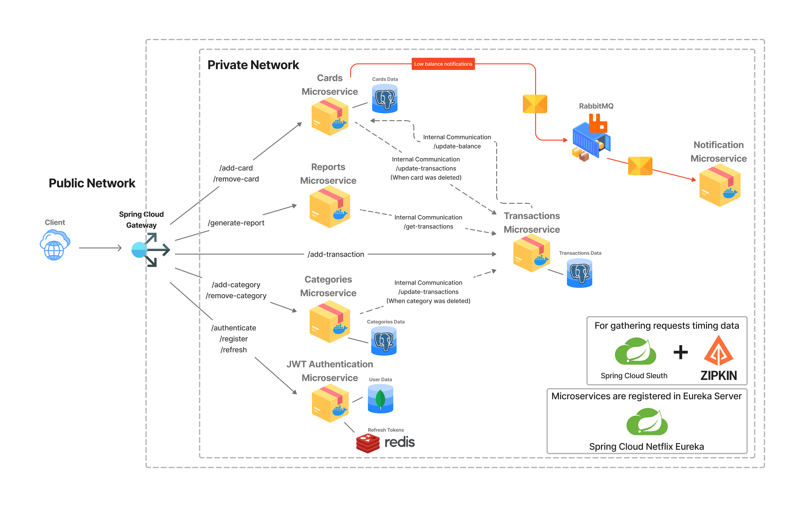

# 👉 What is Moneytron?
> Discover the financial tracker you didn't know you were missing

# 👉 Functionality

- Authentication
- Adding multiple cards
- Adding your own income and expense categories
- Adding income and expenses by category
- Getting reports by cards, dates and categories
- Email notification when card balance is low

# 👉 Structure and microservices

<<<<<<< HEAD
This app has microservice architecture with these structure:

There is short description for all microservices and link to their pages:
1. [JWT Authentication Microservice](https://github.com/pyankovdaniil/Moneytron) - authenticating users, storing their data, generating JWT and Refresh Tokens 
2. [Cards Microservice](https://github.com/pyankovdaniil/Moneytron) -
=======
Moneytron has microservice architecture with this structure:

There is short description for all microservices and link to their pages:
1. [JWT Authentication Microservice](https://github.com/pyankovdaniil/Moneytron/tree/main/Authentication) - authenticating users, storing their data, generating JWT and Refresh Tokens 
2. [Cards Microservice](https://github.com/pyankovdaniil/Moneytron/tree/main/Cards) -
>>>>>>> be9e8d8 (Added empty Cards and Authentication microservices, Eureka, Open Feign and Spring Cloud Gateway)
3. [Categories Microservice](https://github.com/pyankovdaniil/Moneytron) - adding and removing new categories
4. [Transactions Microservice](https://github.com/pyankovdaniil/Moneytron) - adding and deleting income and expenses from user cards
5. [Reports Microservice](https://github.com/pyankovdaniil/Moneytron) - generating reports for user cards, organizing data by dates, prices and categories
6. [Notification Microservice](https://github.com/pyankovdaniil/Moneytron) - sending emails to users when card balance is low
7. [RabbitMQ](https://github.com/pyankovdaniil/Moneytron) - message query for asynchronous interaction between microservices

# 👉 Technologies

- Spring Boot - for microservices
- Hibernate, Spring Data JPA - connecting to DBs, saving objects, adding @Repositories and @Services
- Maven - to build a microservices
- Spring Cloud Gateway - for program entry point 
- PostgreSQL, MongoDB - storing data
- Redis - storing Refresh Tokens
- RabbitMQ - message query for asynchronous interaction between microservices
- Eureka - regisrates every instance of microservices for better scalability
- Open Feign - to get rid of code duplication
- Spring Cloud Sleuth + Zipkin - gather requests timing data
- Docker - to pull images and save all microservices to a containers

<<<<<<< HEAD
=======
# 👉 How to use Moneytron?

---

>>>>>>> be9e8d8 (Added empty Cards and Authentication microservices, Eureka, Open Feign and Spring Cloud Gateway)
# 👉 Installation

# 👉 Contributing

