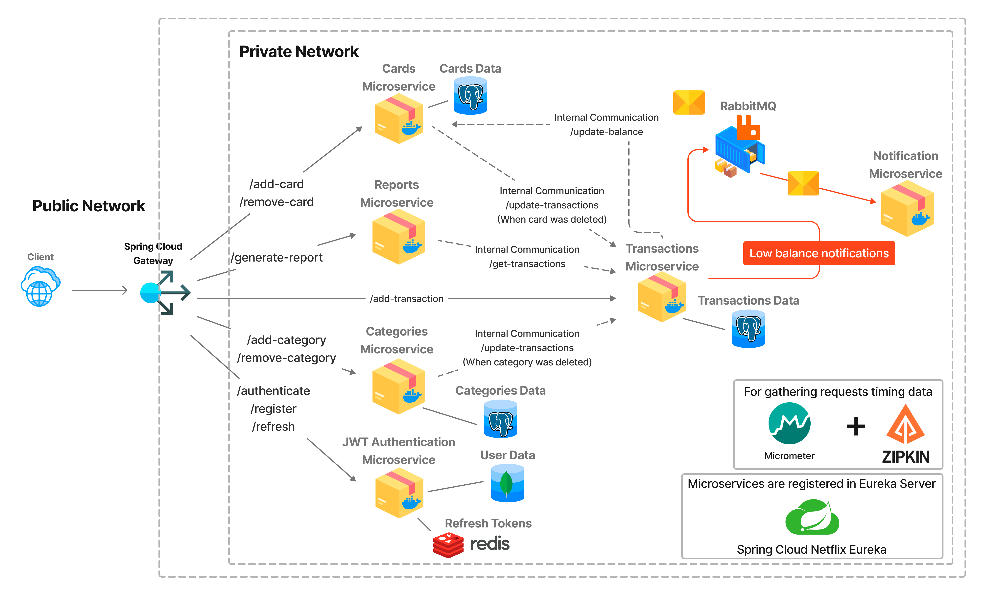
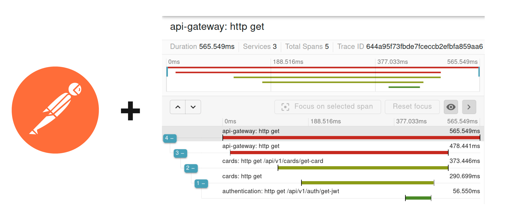

# 👉 What is Moneytron?
> Discover the financial tracker you didn't know you were missing

Moneytron is a finance tracker that allows you to easily controll all you money!

# 👉 Functionality

- Authentication
- Adding multiple cards
- Adding your own income and expense categories
- Adding income and expenses by category
- Getting reports by cards, dates and categories
- Email notification when card balance is low

# 👉 Structure and microservices

Moneytron has microservice architecture with this structure:

There is short description for all microservices and link to their pages:
1. [JWT Authentication Microservice](https://github.com/pyankovdaniil/Moneytron/tree/main/Authentication) - authenticating users, storing their data, generating JWT and Refresh Tokens 
2. [Cards Microservice](https://github.com/pyankovdaniil/Moneytron/tree/main/Cards) - storing information about cards (names and balances)
3. [Categories Microservice](https://github.com/pyankovdaniil/Moneytron) - adding and removing new categories
4. [Transactions Microservice](https://github.com/pyankovdaniil/Moneytron) - adding and deleting income and expenses from user cards
5. [Reports Microservice](https://github.com/pyankovdaniil/Moneytron) - generating reports for user cards, organizing data by dates, prices and categories
6. [Notification Microservice](https://github.com/pyankovdaniil/Moneytron) - sending emails to users when card balance is low
7. [RabbitMQ](https://github.com/pyankovdaniil/Moneytron) - message query for asynchronous interaction between microservices

# 👉 Technologies

- Spring Boot - for microservices
- Hibernate, Spring Data JPA - connecting to DBs, saving objects, adding @Repositories and @Services
- Maven - to build a microservices
- Spring Cloud Gateway - for program entry point 
- PostgreSQL, MongoDB - storing data
- Redis - storing Refresh Tokens
- RabbitMQ - message query for asynchronous interaction between microservices
- Eureka - regisrates every instance of microservices for better scalability
- Open Feign - to set up synchronous comminucation between microservices & get rid of code duplication
- Docker - to pull images and save all microservices to a containers
- Micrometer + Zipkin - test requests timing
- Postman - for generating requests

# 👉 Testing the app

For testing the microservice connection and speed of each microservice I used Micrometer, Zipkin and Postman.

I was making requests with Postman, then get traceID from logs and check the whole path of the request through microservices.

There is an example of how Zipkin allows to easily check the path of the request:

# 👉 How to use Moneytron?

---

# 👉 Installation

# 👉 Contributing

